# Pluto - Career Recommendation Platform 🌍

Welcome to **Pluto**, your all-in-one platform for personalized career recommendations, designed to help you find your path in a confusing world of choices.

---

## 🌟 What's Pluto?

🚀 **Pluto** is a **full-stack application** (FastAPI + Streamlit) that aims to match you with a career path that resonates with your passions, skills, and goals.

Using **NLP techniques and sentence embeddings**, it parses your profile, parses a curated dataset of careers, and then highlights roles that align with you — all in a friendly, interactive UI.

✨ Here's what you can do with Pluto:
        - **Career Compass**: Select your interests and get personalized career suggestions that truly fit you.
        - **Resume Matcher**: Upload your resume and job description to see how well they align, and get smart feedback to improve.
        - **RoadTo (Career Roadmaps)**: Get step-by-step guides to break into different careers, whether you're starting out or switching fields.

        It’s not just a tool — it’s a system built to help you figure out where you actually want to go, and how to get there.

---

## 🛠 Tech Stack

- **Backend:** [FastAPI](https://fastapi.tiangolo.com/) + [Python]
- **NLP:** [Sentence-BERT]
- **API:** Serves career recommendations to the Streamlit UI
- **Front-end:** [Streamlit] — lightweight, UI-centric framework perfect for prototyping
- **Other:** Docker, Git, and a bit of Python scripting

---

## 🔹Features

✅ Personalized career match based on your profile
✅ Semantic search against curated career data
✅ User-friendly Streamlit UI
✅ FastAPI backend with well-structured API endpoints
✅ Easily deployable and lightweight — perfect for prototyping or small scale deployment

---

## 🔹Results
Home Page(UI):

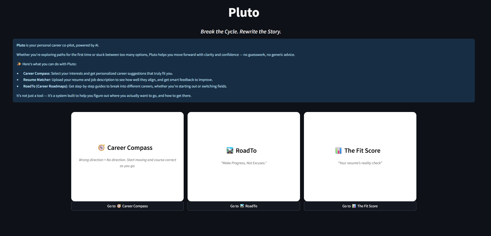

Home Page (Hover effect on card):

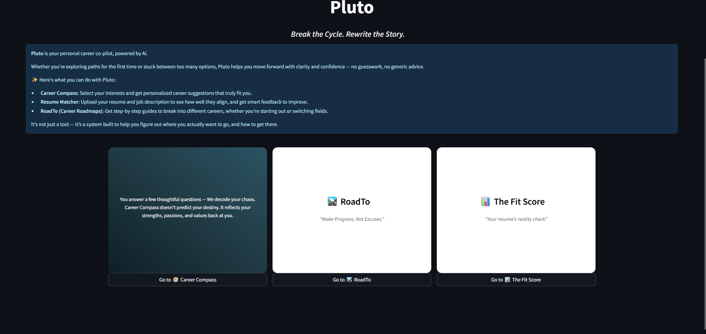

Career Compass[Career Recommendation] UI: 

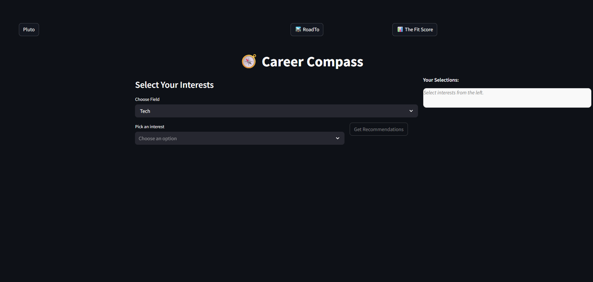

Career Compass Interest Tags Selection:

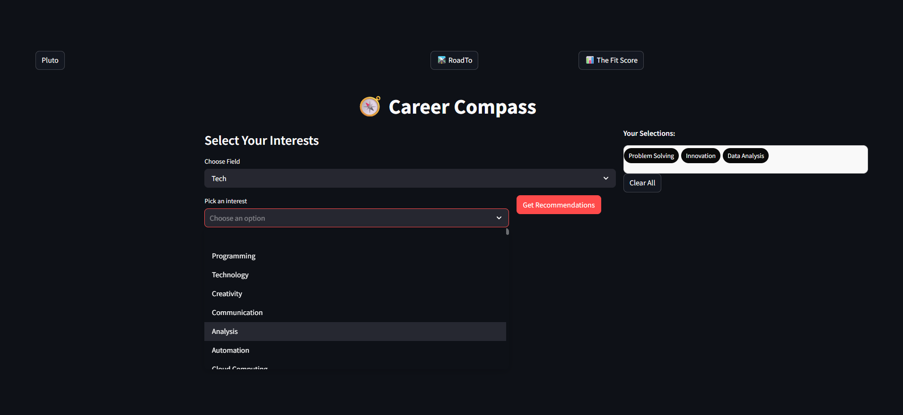

Career Compass - Career recommendation Result:

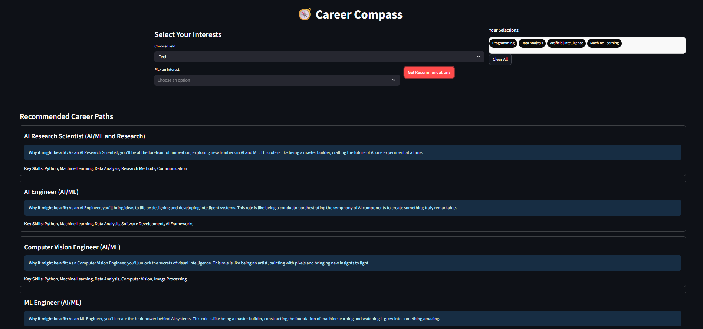

RoadTo[Roadmap] UI:  

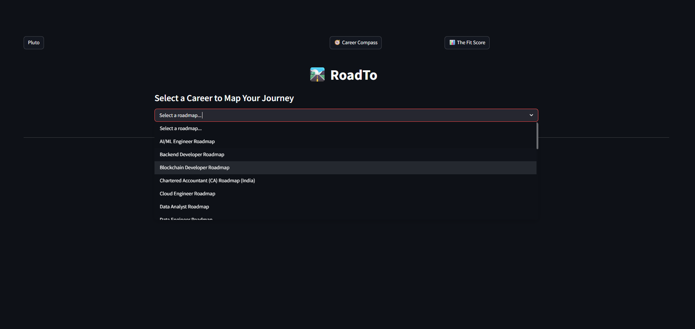

RoadTo Result:

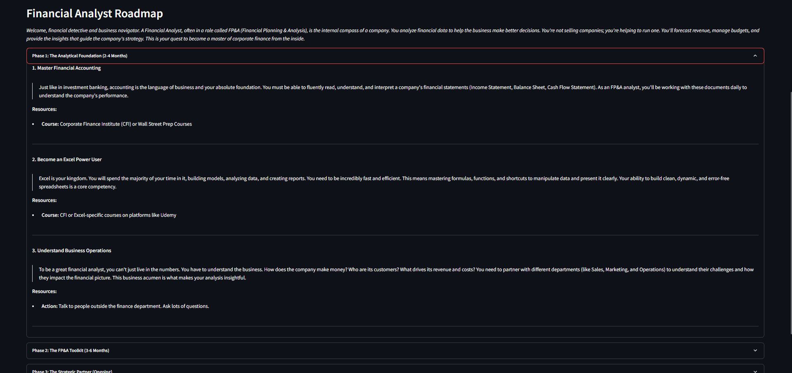

Fit Score[Resume and JD matcher]:

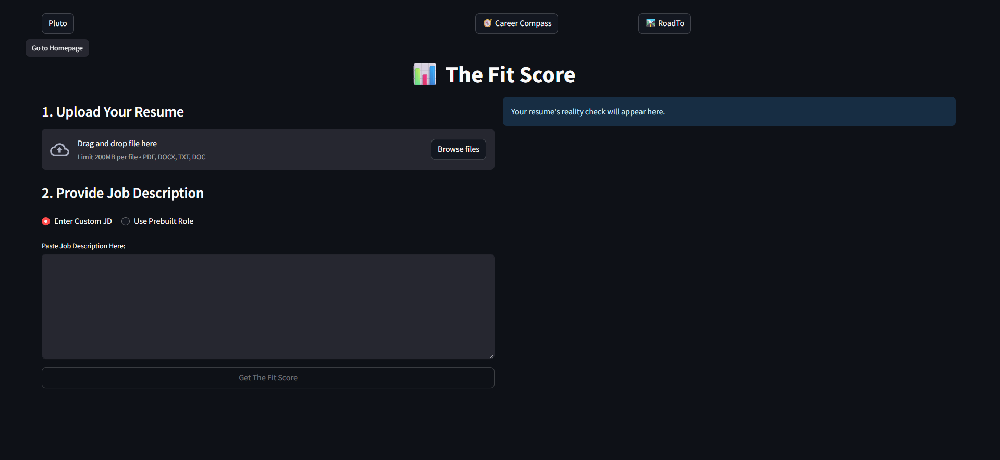

Fit Score With Custom JD:

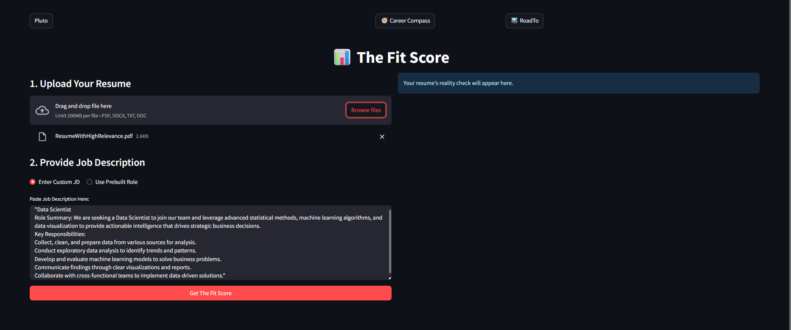

Fit Score With Custom JD Result:

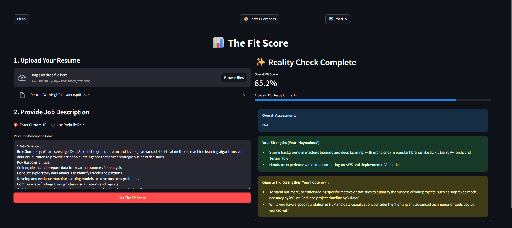

Fit Score With Prebuilt JD:

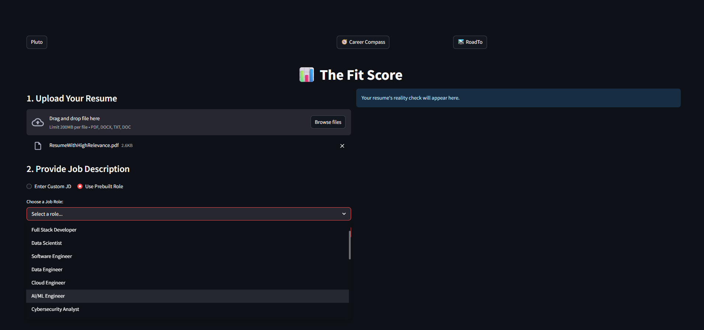

Fit Score With Prebuilt JD Result:

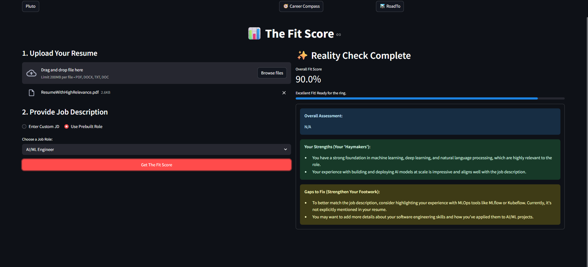

---

## 🔹How to Run (Locally)

➥ **Step 1:** Clone this repository

    git clone https://github.com/yourUsername/Pluto.git

    cd Pluto

➥ **Step 2:** Install the requirements
    
    pip install -r requirements.txt

➥ **Step 3:** Start backend first
    
    uvicorn backend.app.main:app --reload

✅ FastAPI will be available at http://127.0.0.1:8000

➥ **Step 4:** Then start Streamlit
    
    streamlit run frontend/app.py

✅ Streamlit UI will be available at http://localhost:8501

### 🔹**Environment:**

✅ Python 3.9+

✅ FastAPI, Streamlit, sentence transformers, etc.

### 🔹**Possible Improvement Ideas:** 🌟

-> Personalized scoring criteria

-> User authentication

-> Database storage for profiles and preferences

-> Docker Compose for easy deployment

-> Recommendation explanations to aid decision-making

📝 Final Notes

🚀 Pluto is designed to be a lightweight, flexible, and scalable solution for career guidance.
Whether you’re a student unsure about your future or a professional thinking of a change — Pluto aims to cut through the overwhelm and illuminate your path forward.

🚥 If you’d like to contribute, please feel free to submit a pull request or raise an issue!
Together, we can make career guidance smarter.
